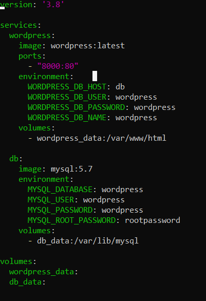

# WordPress with Docker Compose 🐳

This project sets up a WordPress website using Docker Compose with a MySQL backend. It serves as a beginner-friendly demo to understand containerized applications.

---

## 📁 Folder Structure

```bash
wordpress-docker/
├── docker-compose.yml
├── README.md
└── snapshots/
    ├── Docker Compose CLI Output.png
    ├── dockercomposeyml.png
    ├── running status.png
    ├── wordpress dashboard.png
    ├── wordpress dashboard2.png
    ├── wordpress folder structure.png
    └── wordpress hostpage.png
---
Technologies Used:

Docker

Docker Compose

WordPress

MySQL

WSL (Windows Subsystem for Linux)
---

Screenshots Attached 

 Docker Compose Output  


###  docker-compose.yml  


###  WordPress Running Status  


###  WordPress Homepage  


###  Folder Structure  


###  WordPress Admin Dashboard  
  


---

##  How to Run

1. Clone this repo:
   ```bash
   git clone https://github.com/your-username/wordpress-docker.git
   cd wordpress-docker

2. Start containers:
docker compose up -d

3.Access:
WordPress: http://localhost:8000
MySQL: Running on port 3306 (used internally)

4. Stop containers (when done)

---

## 📌 Notes

- This project was tested on **Docker Desktop with WSL (Windows Subsystem for Linux)**.
- Volumes are configured to ensure **data persists** across container restarts.
- All images are stored under the `snapshots/` folder for easy reference.

---

Happy Containerizing! 🐳  
Build, break, and rebuild — that's how we learn 🚀
